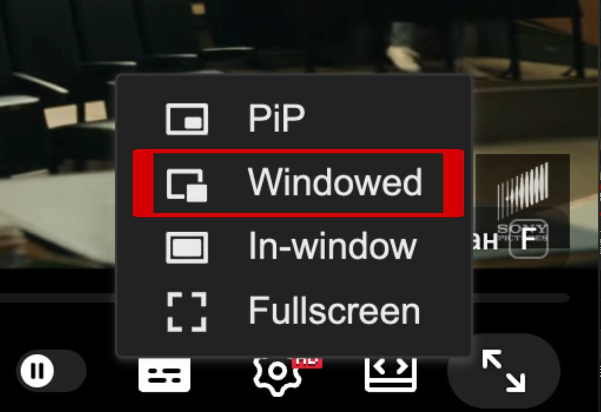

<p align="center">
  
</p>

<h1 align="center">Real-Time Subtitle Translator</h1>

<p align="center">
  <b>A lightweight, real-time screen translation overlay. Select the text on your screen and get instant translations without complex setups or API keys.</b>
</p>

---

## Installation & Running

### Windows

For Windows users, a standalone executable is available.

1. Download the latest `.exe` from the **Releases** page.
2. Double-click to run. No installation or external dependencies are required.

### macOS

*Requires Python >= 3.12.*

1. Install Tesseract (English included) and Tkinter support for Python via Homebrew:

```bash
brew install tesseract python-tk@3.12

```

2. Download the fast models for the remaining 9 languages directly into the Tesseract directory:

```bash
cd $(brew --prefix tesseract)/share/tessdata && curl -LO "https://raw.githubusercontent.com/tesseract-ocr/tessdata_fast/main/{deu,rus,ukr,spa,fra,ita,chi_sim,jpn,por}.traineddata"
```

3. Clone this repository and navigate to the project folder.

```bash
git clone https://github.com/io-23SklyarAnton/ScreenTranslator.git
```

4. Create a virtual environment, activate it, and install dependencies:

```bash
python3.12 -m venv .venv
source .venv/bin/activate
pip install -r requirements.txt

```

5. Run the application:

```bash
python main.py

```

#### Fullscreen Video Workaround (macOS)

The native macOS fullscreen mode automatically hides all custom overlay applications. To translate fullscreen videos (
e.g., on YouTube), it is recommended to install the **[Windowed - floating Youtube/every website](https://chromewebstore.google.com/detail/windowed-floating-youtube/gibipneadnbflmkebnmcbgjdkngkbklb)** browser extension.

Use the specific "Windowed" button highlighted in the image below.



This expands the video to fill the browser window
without triggering the native macOS fullscreen, keeping the translator visible.

### Linux

*Requires Python >= 3.12.*

1. Install Tesseract, the exactly required 10 language packages, and standard Python libraries (Tkinter and venv) for
   Debian/Ubuntu:

```bash
sudo apt update
sudo apt install python3-tk python3-venv tesseract-ocr tesseract-ocr-eng tesseract-ocr-deu tesseract-ocr-rus tesseract-ocr-ukr tesseract-ocr-spa tesseract-ocr-fra tesseract-ocr-ita tesseract-ocr-chi-sim tesseract-ocr-jpn tesseract-ocr-por

```

2. Clone this repository and navigate to the project folder.
3. Create a virtual environment, activate it, and install dependencies:

```bash
python3 -m venv .venv
source .venv/bin/activate
pip install -r requirements.txt

```

4. Run the application:

```bash
python main.py

```
